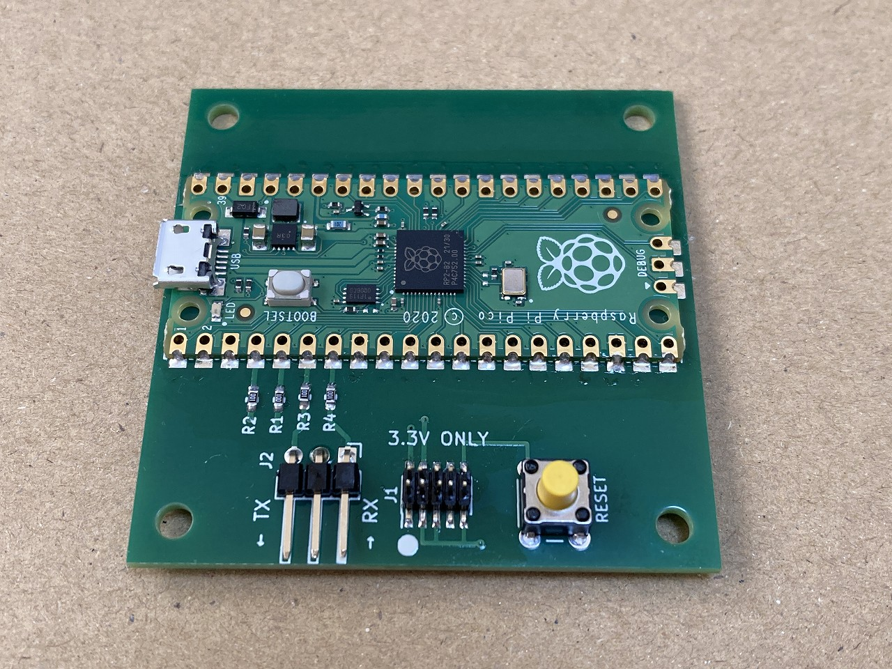
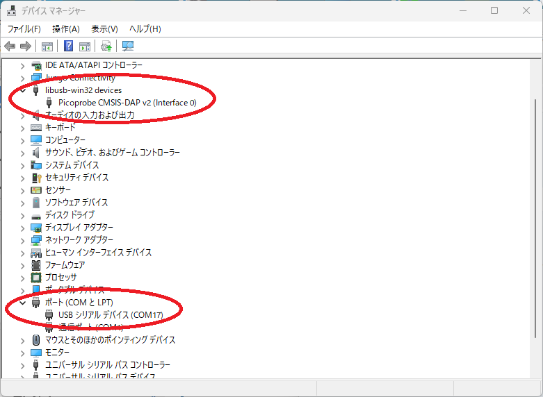
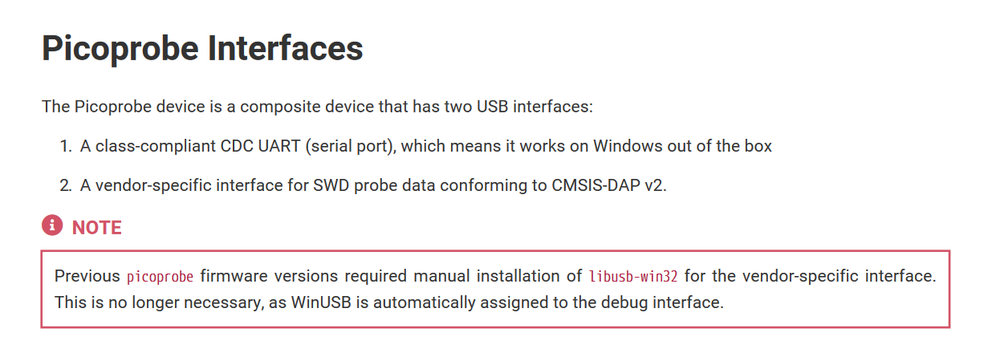
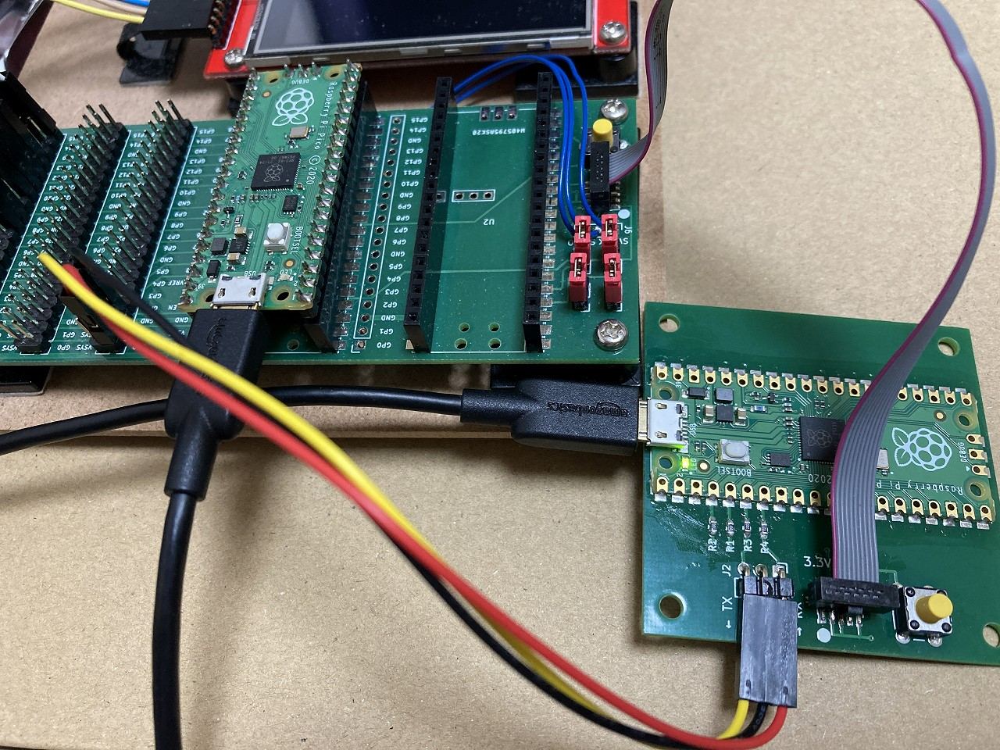
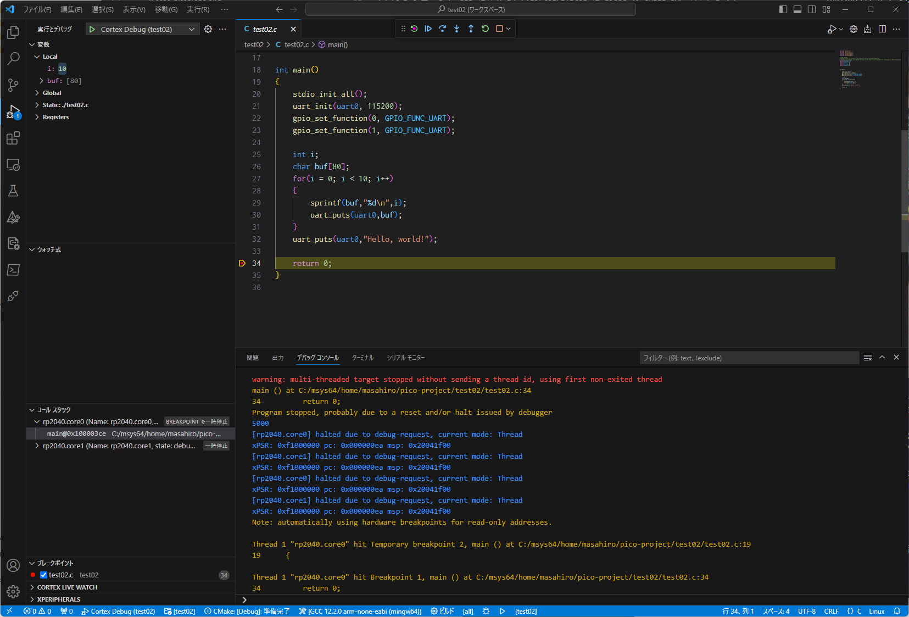
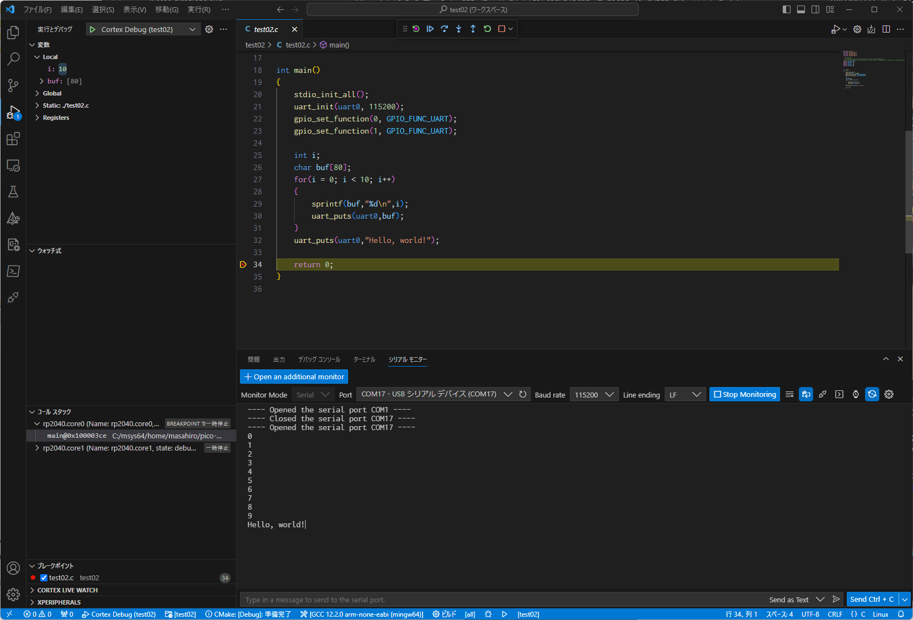

# Raspberry Pi Pico SWD Debugger




# この基板について

PicoProbe という SWD デバッガにハーフピッチの 2x5 10pin ヘッダをつけた基板です。
SWDIO と SWCLK の 2線でデバッグするデバッガとなります。 opnocd -f interface/cmsis-dap.cfg で使用可能なデバッガですので汎用タイプになります。
ただし、<font color="red"><b>ターゲットの電圧は 3.3V 固定</b></font> となります。

基本的には 下記リンクにある NXP社の MCU-Link, MCU-Link Pro をお勧めします。数年前まで秋月などで安く購入出来た NXP LPC-Link2 の後継です。これでしたら、ターゲットの電圧 1.2V - 5V 対応です。


 [MCU-Link Debug Probe](https://www.nxp.jp/design/software/development-software/mcuxpresso-software-and-tools-/mcu-link-debug-probe:MCU-LINK)

[MCU-Link Pro Debug Probe](https://www.nxp.jp/design/software/development-software/mcuxpresso-software-and-tools-/mcu-link-pro-debug-probe:MCU-LINK-PRO)

当基板は、基本的には SWD デバッガの相性問題などで別のデバッガを試してみたいなどにご利用ください。

<b>ターゲットプロセッサやホスト OS、openocd のバージョンや openocd のコンフィグファイルなどの設定内容によって相性問題はかなりの確率で発生すると思われます。相性問題に伴う保証はできません。</b> MCU-Link もお勧めはしていますが、これも全ての環境で完璧に動くわけでも無いため同様に保証することはできません。

# 使用法

## 準備
基基板に USB ケーブルを接続し PC に接続してください。

■Windows 



CMSIS-DAP インタフェースが libusb-win32 に、シリアルポートがポート(COMとLPT)に表示されたら問題ありません。



ただし、Getting Start マニュアルには以前は libusb-win32 が必要だったけど、今はいい。とあるので、WinUSB で認識されていても問題ないと重います。最新 PicoProbe のファームウエア picoprobe-cmsis-v1.0.3 は libusb-win32 でも動いています。

現状 CMSIS-DAP が見えていたら動くと思われます。動かない場合は zadig コマンドをネットからダウンロードして、CMSIS-DAP のドライバを切り替えばいいです。

■Linux の場合は、openocd にある udev の .rules ファイルを /etc/udev/rules.d にコピーして
```
$ sudo udevadm control --reload-rules
$ sudo udevadm trigger
```

あとは、シリアルポートをユーザーが使えるように dialout グループにユーザー追加します。
```
$ sudo usermod -aG dialout ユーザー名
```

デバッグプローブを USB に挿して、/var/log/syslog に probe の CMSIS-DAP 名や、シリアルポートが ttyUSB0 などにアタッチされたメッセージがでていれば問題ありません。

# 結線



PicoProbe 基板とターゲットの基板をフラットケーブルで接続します。uart を使用する場合は、Lアングルのピンヘッダにマイコンの TX/RX を接続してください。

# vscode 表示例

「実行」「デバッグの開始」を選択してデバッグを開始します。openocd・gdb-multiarch が問題なく起動できれば、プログラムがターゲットに書き込まれてデバッグが始まります。
↓のスクリーンショットのように変数が表示されたりしていればデバッガは動いています。また、プログラムのプリント出力も、vscode のシリアルモニタに表示されていれば問題はありません。





# 回路図・ガーバーファイル
回路図は Schematic.pdf を参照してください。  
ガーバーファイルは KiCad/20231007 フォルダを参照してください。

# 部品表

上記組み立て例の部品表は以下のようになります。

|部品番号|部品名|数量|通販アドレス|備考|
|---|---|---|---|---|
|U1|Raspberry Pi Pico|1|https://akizukidenshi.com/catalog/g/gM-16132/||
|J1|ピンヘッダ　２×５（１０Ｐ）　表面実装用　１．２７ｍｍピッチ|1|https://akizukidenshi.com/catalog/g/gC-10904/||
|J2|ピンヘッダ　Ｌ型　１×３　（３Ｐ）|1|https://akizukidenshi.com/catalog/g/gC-15510/||
|SW1|タクトスイッチ|1|https://akizukidenshi.com/catalog/g/gP-03650/|リンクは黄色の例|
|R1-R4|10Ω 0603(1608)|4|||
||２×５（１０Ｐ）両端コネクタ付ＩＤＣリボンケーブル（フラットケーブル　ハーフピッチ）|1|https://akizukidenshi.com/catalog/g/gC-06776/|||
||プリント基板|1||||

# 引用
Raspberry Pi PICO の KiCad ライブラリは https://github.com/ncarandini/KiCad-RP-Pico を利用しています。

PicoProbe は、https://github.com/raspberrypi/picoprobe の公式ファームウエアを使用しています。

